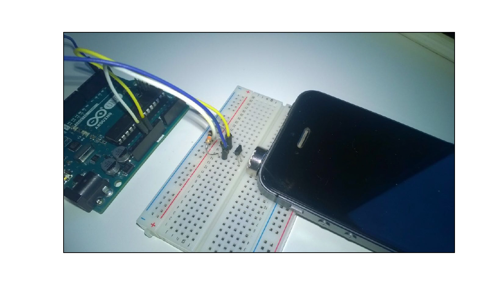
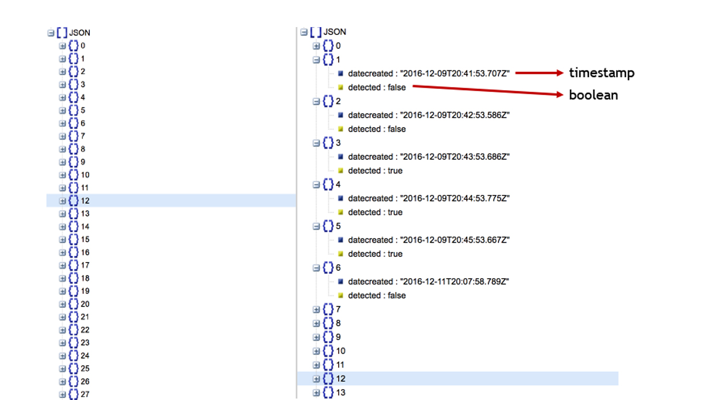
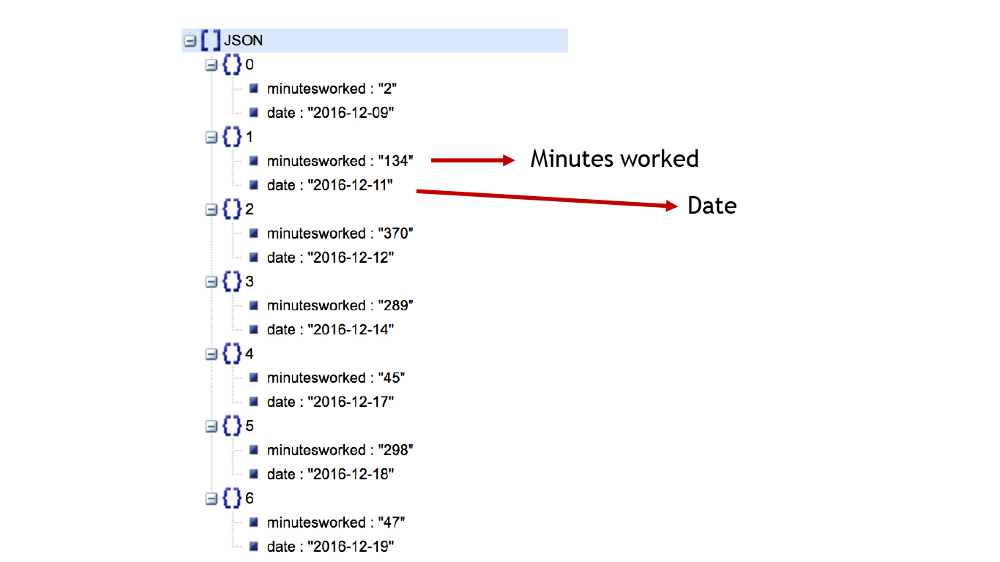
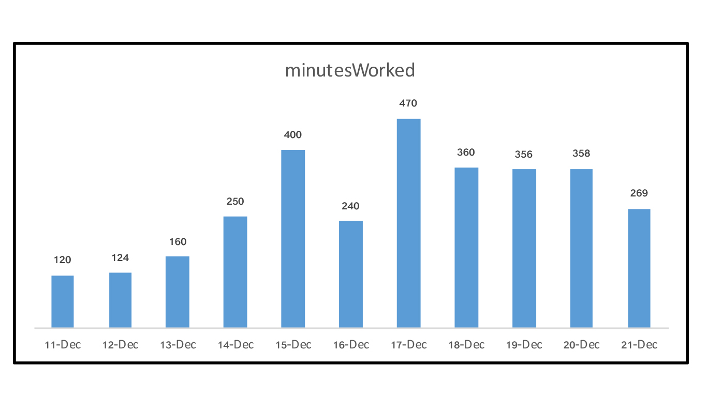

### Final Assignment 2:

#### Working URL:
https://data-structures-final-jainsambhav.c9users.io:8081/

---

sensor.js : code to write data from sensor to PostgreSQL database 

sensor-output.js : code to display aggregated data from PostgreSQL database

---

Apparatus:
 

Raw Data:
 

Aggregated Data for visualization: 
 

Visualization prototype:

